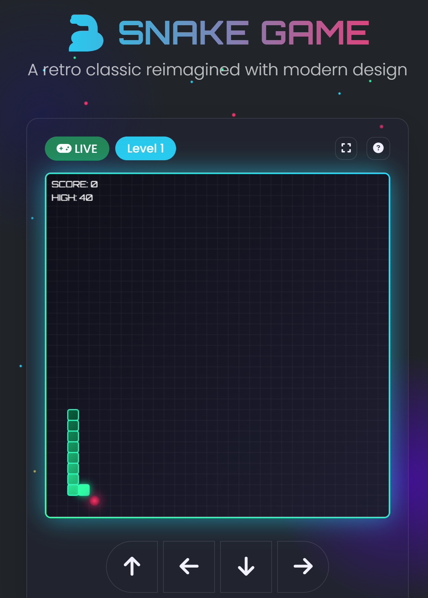

# Snake Game - Flask Backend



A classic Snake game with a modern web stack: Flask backend, JavaScript frontend, and responsive design.

**[Powered by PyShine](https://pyshine.com/)** - Simple and practical Python tutorials for everyone.

## Features

- **Full game engine** with snake movement, food generation, collision detection
- **Sound effects** using Howler.js (eat, game over, level up, click)
- **Responsive UI** built with Bootstrap 5 and glass-morphism design
- **RESTful API** for game state management
- **Cross-platform** - runs in any modern browser
- **Dark theme** with customizable colors

## Quick Start

### 1. Clone the repository

```bash
git clone https://github.com/pyshine-labs/cool-snake-web-game.git
cd cool-snake-web-game
```

### 2. Set up Python environment

```bash
python -m venv venv

# On Windows:
venv\Scripts\activate
# On macOS/Linux:
source venv/bin/activate

pip install -r requirements.txt
```

### 3. Run the Flask development server

```bash
python app.py
```

Open your browser at [http://localhost:5000](http://localhost:5000) and start playing!

## Controls

| Key | Action |
|-----|--------|
| Arrow Keys / WASD | Move snake |
| Space | Pause/Resume |
| Escape | Open settings |

## Project Structure

```
cool-snake-web-game/
├── app.py                    # Main Flask application
├── config.py                 # Configuration settings
├── requirements.txt          # Python dependencies
├── .gitignore
├── README.md
├── snake_game_intro.PNG      # Intro screenshot
├── static/                   # Front-end assets
│   ├── css/style.css         # Game styles
│   ├── js/                   # JavaScript modules
│   │   ├── game.js           # Game engine
│   │   ├── main.js           # Main entry point
│   │   ├── sound.js          # Sound manager
│   │   ├── ui.js             # UI controller
│   │   ├── utils.js          # Utility functions
│   │   └── polyfills.js      # Browser compatibility
│   └── assets/               # Images, sounds
│       └── sounds/           # WAV audio files
├── templates/                # Flask HTML templates
│   └── index.html
├── api/                      # API Blueprint
│   ├── __init__.py
│   └── routes.py
└── models/                   # Data models
    ├── __init__.py
    └── game.py               # Game state management
```

## API Endpoints

| Method | Endpoint | Description |
|--------|----------|-------------|
| GET    | `/` | Serve the main game page |
| GET    | `/health` | Health check |
| GET    | `/api/game/state` | Retrieve current game state |
| POST   | `/api/game/start` | Start a new game |
| POST   | `/api/game/move` | Change snake direction |
| POST   | `/api/game/pause` | Pause/resume the game |
| POST   | `/api/game/reset` | Reset game |
| GET    | `/api/score` | Get high scores |

## Game Settings

- **Grid visibility** - Toggle grid lines
- **Wall collision** - Enable/disable wall boundaries
- **Game speed** - Adjust snake movement speed
- **Snake color** - Customize snake appearance
- **Sound effects** - Toggle audio on/off
- **Background music** - Toggle music on/off

## Browser Requirements

- Chrome 58+, Firefox 54+, Safari 12+, Edge 16+
- JavaScript ES2017 support
- Web Audio API

## License

MIT

## Acknowledgments

- Inspired by the classic Nokia Snake game
- Built with [Flask](https://flask.palletsprojects.com/), [Bootstrap](https://getbootstrap.com/), and [Howler.js](https://howlerjs.com/)
